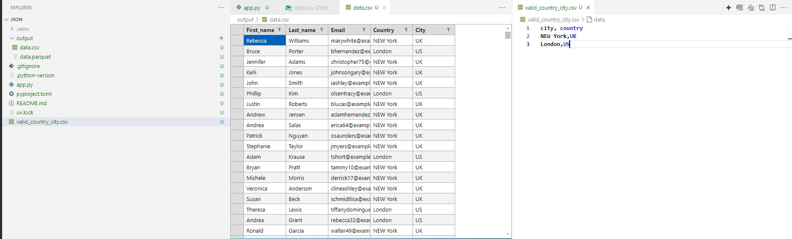

# S3 Faker


## Overview

**S3 Faker** is a tool designed to generate fake data based on a JSON configuration file. The generated data can be saved locally and also uploaded to an AWS S3 bucket. This project is ideal for testing and development purposes where realistic data is required without using actual user data.

## Features

- Generate fake data using the [Faker](https://faker.readthedocs.io/en/master/) library.
- Save generated data in multiple formats: CSV, JSON, and Parquet.
- Upload data to AWS S3 using [s3fs](https://s3fs.readthedocs.io/en/latest/).
- Configurable via a JSON file to specify data schema and output formats.
- Supports dependency grouping for columns that reference each other.

## Getting Started

### Prerequisites

- Python 3.12 or higher
- Docker (for running LocalStack) and Localstack CLI
- AWS CLI (for interacting with AWS services), awsclient-local wrapper for AWS.

### Project Directory Structure

- Here is the structure of the project directory with descriptions for important files and folders:

    ```sh
    s3_faker                        # Project Struc
    ├── .github
    │   └── workflows
    │       └── test_scripting.yml  # GitHub Actions workflow file
    ├── img                         # Directory containing images for the README
    ├── output                      # Directory for output files
    ├── .env                        # Environment variables file
    ├── .gitignore                  # Git ignore file
    ├── app.py                      # Main application script
    ├── pyproject.toml              # Project configuration file
    ├── README.md                   # Project README file
    ├── requirements.txt            # Python dependencies file
    ├── test_scripting.ps1          # PowerShell script for testing
    ├── test_scripting_git_bash.sh  # Bash script for testing
    └── valid_country_city.csv      # CSV file with valid country and city data
    ```

### Installation

1. Clone the repository:

    ```sh
    git clone https://github.com/mrxsierra/s3_faker.git
    cd s3_faker
    ```

2. Install the required Python packages:

    ```sh
    python -m pip install --upgrade pip
    pip install -r requirements.txt
    ```

### Configuration

The data generation is driven by a JSON configuration file. Below is an example configuration:

```json
{
  "output_files": {
    "csv": "output/data.csv",
    "parquet": "output/data.parquet",
    "json": "s3://mamoke-bucket/json_data.json",
    "csv": "s3://mamoke-bucket/csv_data.csv",
    "parquet": "s3://mamoke-bucket/parquet_data.parquet"
  },
  "file_size": 1000,
  "columns": [
    {
      "index": 1,
      "name": "first_name",
      "position": 1,
      "data_type": "first_name",
      "valid_values_csv": null,
      "valid_values_csv_column_index": null,
      "same_valid_value_row_as_column": null,
      "validation_regex": null
    },
    {
      "index": 2,
      "name": "last_name",
      "position": 2,
      "data_type": "last_name",
      "valid_values_csv": null,
      "valid_values_csv_column_index": null,
      "same_valid_value_row_as_column": null,
      "validation_regex": null
    },
    {
      "index": 3,
      "name": "email",
      "position": 3,
      "data_type": "email",
      "valid_values_csv": null,
      "valid_values_csv_column_index": null,
      "same_valid_value_row_as_column": null,
      "validation_regex": "^[a-zA-Z0-9._%+-]+@[a-zA-Z0-9.-]+\\.[a-zA-Z]{2,}$"
    },
    {
      "index": 4,
      "name": "country",
      "position": 4,
      "data_type": null,
      "valid_values_csv": "valid_country_city.csv",
      "valid_values_csv_column_index": 0,
      "same_valid_value_row_as_column": "city",
      "validation_regex": null
    },
    {
      "index": 5,
      "name": "city",
      "position": 5,
      "data_type": null,
      "valid_values_csv": "valid_country_city.csv",
      "valid_values_csv_column_index": 1,
      "same_valid_value_row_as_column": "country",
      "validation_regex": null
    }
  ]
}
```

### Setting Up Environment Variables

Before running LocalStack, you need to get the `LOCALSTACK_AUTH_TOKEN` from the [LocalStack.cloud](https://app.localstack.cloud/) site. Set this token and other AWS environment variables in a `.env` file:

```properties
AWS_ACCESS_KEY_ID=test
AWS_SECRET_ACCESS_KEY=test
AWS_ENDPOINT_URL=http://localhost:4566
LOCALSTACK_AUTH_TOKEN=your_localstack_auth_token
```

Replace `your_localstack_auth_token` with the actual token you get from the LocalStack site.

### Usage

1. Start Docker Desktop.
2. set Localstack_Auth_Token and start localstack

    ```bash
    # Set auth token 
    LOCALSTACK_AUTH_TOKEN=<your_localstack_auth_token>

    # Start localstack
    localstack start
    ```

3. Create s3 bucket, In New Terminal run 

    ```bash
    # Create bucket
    awslocal s3 mb s3://my-bucket-name
    ```

4. Run the data generation script:

    ```sh
    # Generate data
    python app.py  # require .env variables
    ```

5. The generated data will be saved to the specified output files, both locally and in the S3 bucket.

6. Stop localstack

    ```bash
    # Stops Localstacks
    localstack stop
    ```

### GitHub Actions Workflow

This project includes a GitHub Actions workflow to automate the process of checking Docker, starting LocalStack, setting environment variables, creating an S3 bucket, running the app.py script, and stopping LocalStack.

The workflow is triggered on a push to the `main` branch. You can find the workflow configuration in `.github/workflows/test_scripting.yml`.

### Additional Scripts

#### test_scripting_git_bash.sh

This script is designed to be run in a Git Bash environment on Windows. It performs the following tasks:

1. Opens Docker Desktop.
2. Starts LocalStack in a new terminal.
3. Waits for LocalStack to start.
4. Creates an S3 bucket.
5. Runs app.py.
6. Stops LocalStack.

Usage:

```bash
./test_scripting_git_bash.sh
```

#### test_scripting.ps1

This PowerShell script performs similar tasks as the Bash script but is designed to be run in a PowerShell environment on Windows. It performs the following tasks:

1. Opens Docker Desktop.
2. Starts LocalStack in a new terminal.
3. Creates an S3 bucket.
4. Runs app.py.
5. Stops LocalStack.

Usage:

```powershell
./test_scripting.ps1
```

## Contributing

Contributions are welcome! Please open an issue or submit a pull request for any improvements or bug fixes.

## License

This project is licensed under the MIT License. See the LICENSE file for details.

## Contact

For any inquiries, please contact [sunydiji@gmail.com](mailto:sunydiji@gmail.com).

---

## Images

#### LocalStack Resource


This image shows the resources managed by LocalStack.

#### Faker Data Generation



This image demonstrates the data generation process using the Faker library.
